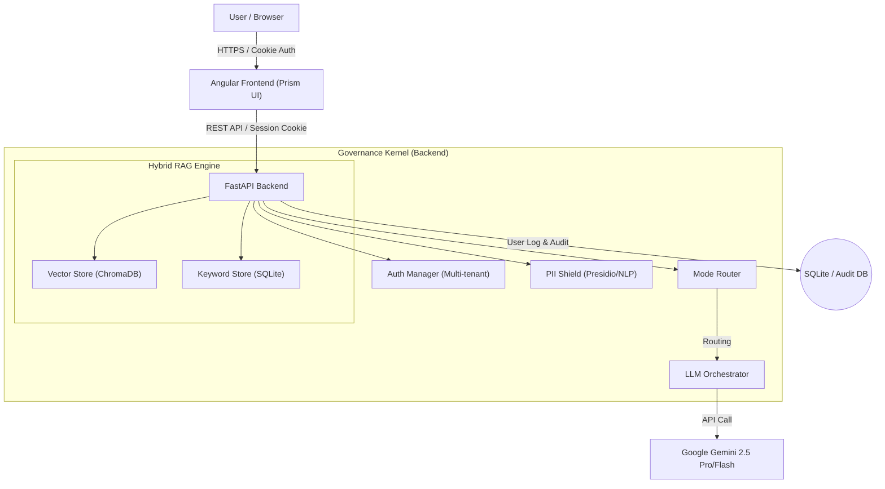

# 🔺 Prism - Enterprise AI Governance Hub

> **Intelligent Gateway for Secure, Cost-Optimized, and RAG-Enhanced LLM Orchestration.**


**Prism (プリズム)** は、企業利用を想定し、セキュリティとコスト管理を両立させた次世代の AI ガバナンス・プラットフォームを **「PoC & 学習用」** に実装したリファレンスプロジェクトです。
ユーザーと LLM の間に「ガバナンス・カーネル」を配置することで、安全に社内情報（RAG）を活用し、業務特化型の推論を実現します。

> ℹ️ **Important / このリポジトリについて**
>
> * 本プロジェクトは、**生成 AI / AI エージェントを活用した開発プロセスの検証**と、
>   **アーキテクチャ学習・技術ポートフォリオ**を主目的としています。
> * すぐに商用本番での利用を推奨するものではありません（詳細は「Project Status & Known Limitations」を参照）。

---

## 🚀 Key Features (主な機能)

### 1. 🛡️ AI-Powered PII Shield (NLP Detection) [NEW]

**Microsoft Presidio** を採用した、次世代の個人情報保護機能を搭載。従来の正規表現（Regex）に加え、**自然言語処理（NLP/NER）** を用いて文脈を解析します。

* **コンテキスト検知:** 「東京都港区...」のような住所や、「山田太郎」のような人名を、特定のフォーマットに依存せず文脈から高精度に特定。
* **自動マスキング:** 検知した機密情報を AI 送信前に `[PII Masked]` に置換し、漏洩を未然に防止。

### 2. 🔐 Multi-User & Secure Login

複数ユーザーによる同時ログインとセッション分離に対応。

* **個別認証:** ユーザーごとの ID 管理により、セキュアなアクセス制御を実現。
* **履歴の分離:** チャット履歴や監査ログはユーザー ID（`user_id`）に紐づいて管理され、他者のデータと混在することはありません。
* **マルチテナント (Mock):** テナント間のデータと知識（RAG）を論理的に分離するモック実装を提供。

> ⚠️ 実運用では、Mock Auth を OIDC/SAML ベースの SSO (Entra ID, Auth0, Google Workspace 等) に差し替える必要があります。

### 3. 🧠 Hybrid RAG (Retrieval-Augmented Generation)

**ChromaDB (ベクトル検索)** と **SQLite (キーワード検索)** を組み合わせたハイブリッド検索エンジンを搭載。

* **ナレッジベース:** 社内規定やマニュアルを登録し、AI に「長期記憶」を持たせることが可能。
* **高精度な検索:** 「概念（ゼロトラスト）」と「品番（PROJ-A77）」の両方を正確に検索し、ハルシネーション（嘘）を抑制。

### 4. ✨ Modern Tabbed UI & UX [NEW]

* **Tab Navigation:** 「チャット」と「ナレッジベース管理」を直感的なタブ UI で切り替え可能。
* **ストリーミング応答:** AI の回答をリアルタイムで逐次表示。
* **監査ログ:** 全会話・モデル・推論メタ情報を DB に記録し、サイドバーからログを復元・監査可能。

### 5. 🛡️ Governance & Dynamic Routing

入力内容をリアルタイムで解析し、最適な「モード」へ自動ルーティングします。

* **FLASH Mode:** ニュースや株価などの速報（Web 検索利用を想定）。
* **HEAVY Mode:** 契約書や医療情報の精密分析（PII 検知・高精度モデル）。

---

## 📌 Project Status & Known Limitations (位置づけと既知の制約)

Prism は、**エンタープライズ AI ゲートウェイのアーキテクチャ検証 & 学習用途の PoC** として設計されています。
そのため、以下のような制約・未対応事項があります。

### 認証・認可 / Auth & RBAC

* 現在は **Mock Login + 固定 SECRET_KEY** による簡易 JWT 認証です。
* SSO (OIDC / SAML)・外部 IdP 連携は未実装です。
* RBAC はアプリケーションレベルの簡易ロールのみで、
  組織階層（部署 / プロジェクト）やきめ細かい権限モデルは未整備です。

### マルチテナント / Multi-Tenancy

* `tenant_id` 列、および `governance_docs_{tenant_id}` といったコレクション名による **論理分離** を採用しています。
* テナント単位のリソース制限、データレジデンシ、削除・エクスポートフローなど、本番 SaaS 相当の機能は未実装です。

### セキュリティ・機密情報 / Security & PII

* PII 検出には Presidio を使用していますが、**すべての個人情報・機密情報を検出できる保証はありません**。
* ログ・RAG ストアの暗号化、保存期間ポリシー、アクセス監査などは PoC レベルです。
* **高機密情報は本システムに登録しない / 入力しない** 前提での利用を想定しています。

### 信頼性・スケーラビリティ / Reliability & Scaling

* 単一プロセス構成を前提としており、スケールアウト・冗長化・SLO/SLA 設計は行っていません。
* LLM API 障害時のフォールバック戦略（モデル切り替え・RAG 無し回答拒否など）は最小限です。
* 高トラフィック環境での負荷試験は行っていません。

### 観測性・評価 / Observability & Evaluation

* 監査ログ（誰が・いつ・どのテナントで・何を聞いたか）は SQLite に記録していますが、メトリクス / トレース / ダッシュボードは未整備です。
* RAG / LLM の品質評価は限定的なテストと手動確認が中心で、自動評価パイプラインは今後の課題です。

> ✅ **Positioning**
>
> * アーキテクチャ学習・PoC・技術提案デモ → **適した用途**
> * 機密情報を含む本番業務 / SLA 付きサービス → **追加設計・実装が必須**

---

## 📘 Learning Resources (学習用ドキュメント)

このリポジトリは、**ソースコードからアーキテクチャを学びたい人向けの解説ドキュメント**も同梱しています。

* **Backend Explanation (バックエンド解説)**
  `backend_explanations.md` – FastAPI / ガバナンスカーネル / RAG / ログ周りを、**行ごとに日本語でコメント付き解説**したドキュメント。

* **Frontend Explanation (フロントエンド解説)**
  `frontend_explanations.md` – Angular UI 全体を、**HTML/TS/CSS 単位で日本語コメント付き**で解説したドキュメント。

> 学習の進め方としては、まず README のアーキテクチャ図 →
> `backend_explanations.md` の `main.py` / `rag_kernel.py` →
> `frontend_explanations.md` の `app.ts` / `chat.service.ts`
> の順に読むと理解しやすい構成になっています。

---

## 🛠 Architecture

Frontend (Angular) と Backend (FastAPI) によるモダンな疎結合アーキテクチャを採用しています。
認証には HttpOnly Cookie を採用し、XSS 対策を強化しています。



### Tech Stack

* **Frontend:** Angular 16+, Angular Material (Enterprise UI), Signals, ngx-markdown
* **Backend:** Python 3.11+, FastAPI (ASGI/Async), SQLModel
* **Governance:** Microsoft Presidio, spaCy (ja_core_news_lg)
* **Auth:** Mock Auth (Development) / Ready for OIDC (Production), HttpOnly Cookie
* **AI Engine:** Google Gemini 2.5 Pro / Flash (Dynamic Model Routing)
* **Data:** ChromaDB (Vector Search), SQLite (Audit Logs & Keyword Search)

---

## 🤝 Contribution & Contact (利用上の注意)

**⚠️ ご利用の前に**

本プロジェクトは、筆者のポートフォリオおよび技術検証用として、**AI 駆動開発（AI-Driven Development）** によって作成されました。

**本コードをフォーク、または商用利用・大規模展開のためにご活用される場合は、必ず事前に筆者までご連絡をお願いいたします。**
（学習用・個人利用の範囲であればご自由に参照ください）

| 項目        | 詳細                                                                                       |
| :-------- | :--------------------------------------------------------------------------------------- |
| **連絡先**   | GitHub Issue または [kanade.yumesaki.mail@gmail.com](mailto:kanade.yumesaki.mail@gmail.com) |
| **ライセンス** | MIT (商用利用可能ですが、上記連絡をお願いします)                                                              |

---

## 📦 Installation & Quick Start

### 1. System Requirements (システム要件)

本バージョンより、高精度な NLP モデル（spaCy Large Model）を搭載しているため、メモリ要件が変更されています。

* **Docker:** Docker Desktop の設定で、メモリ割り当てを **4GB 以上** にすることを推奨します。
* **Disk:** 初回ビルド時に約 600MB の NLP モデルをダウンロードします。

### 2. Default Login Credentials (初期ログイン情報)

本バージョン (v1.2.0) では、開発用として以下の **Mock アカウント** が初期設定されています。ログイン画面では以下の組み合わせを入力してください。

| Role      | Tenant ID  | User ID  | 権限               |
| :-------- | :--------- | :------- | :--------------- |
| **Admin** | `tenant-a` | `user-1` | **管理者** (全ログ閲覧可) |
| User      | `tenant-a` | `user-2` | 一般ユーザー (自分のログのみ) |
| User      | `tenant-b` | `user-1` | 別テナントの一般ユーザー     |

> [!WARNING]
> **Production Security Alert (商用利用時の注意)**
>
> 上記の `Mock Auth` および初期アカウントは、**開発・テスト専用**です。
>
> 1. **Switch to Real IdP:** `backend/auth.py` のモックロジックを無効化し、Azure AD (Entra ID), Auth0, Google Workspace 等の OIDC/SAML 認証プロバイダに接続する実装へ差し替えてください。
> 2. **Disable Mock Login:** `/auth/mock-login` エンドポイントを削除または無効化してください。
> 3. **Rotate Keys:** `.env` 内の `SECRET_KEY` は、推測不可能な長く複雑な文字列に変更してください。

### 3. Docker Launch (推奨)

```bash
# 1. 環境変数の設定
cp .env.example .env
# .env を編集し、GEMINI_API_KEY を設定してください

# 2. 起動
docker-compose up -d --build
```

Access: `http://localhost`

### 4. Manual Launch (開発用)

```bash
# Backend
cd backend
python -m venv .venv
source .venv/bin/activate  # Windows: .\.venv\Scripts\Activate
pip install -r requirements.txt

# 【重要】NLPモデルのダウンロード
python -m spacy download ja_core_news_lg

uvicorn main:app --reload --port 8000
```

```bash
# Frontend
cd frontend
npm install
ng serve
```

Access: `http://localhost:4200`

---

## ⚙️ Configuration (Policies)

`backend/policies.yaml` を編集することで、ガバナンスルールをノーコードで調整可能です。

```yaml
modes:
  - id: "HEAVY"
    safety_level: "high"
    allow_web_search: false # 社内秘情報の流出防止
    triggers:
      keywords_any: ["契約", "法務", "PII"]
```

---

## 🗺️ Future Work (今後の改善候補)

* 認証・認可

  * OIDC / SAML を用いた SSO (Entra ID / Google Workspace / Okta 等) との連携
  * テナント / 部署 / ロールを統合的に扱う RBAC の導入
* 情報分類とポリシー

  * ドキュメントに `classification` (PUBLIC / INTERNAL / CONFIDENTIAL / STRICT 等) を付与
  * STRICT レベルの情報はシステム登録禁止とする運用ルールとシステムガード
* RAG 基盤の強化

  * スコアに基づく再ランキング
  * 参照ドキュメント ID・ソース情報の UI 表示
  * 評価用データセットと自動テストスクリプトの整備
* ガバナンス・安全性

  * 回答側にも PII / 機密ワードフィルタを適用
  * モード (FAST / HEAVY / FLASH) ごとのより細かな制御ルール
* 運用・監視

  * メトリクスエンドポイントとダッシュボードテンプレート
  * LLM API 障害時のフォールバック戦略

---

## 📝 License

[MIT License]([https://openso](https://openso)
